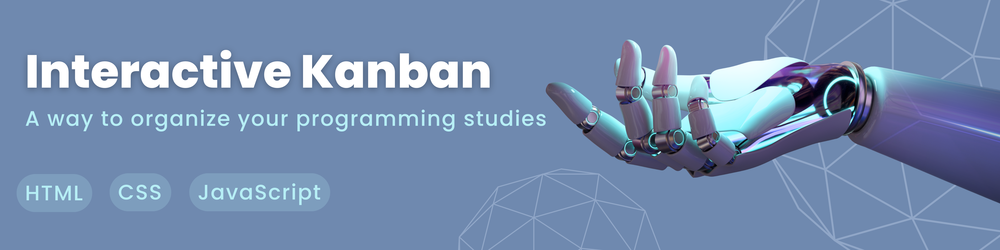

# Programming Study Kanban Board

A dynamic, interactive Kanban board for tracking and managing programming study tasks, built with HTML, CSS, and JavaScript.

## Table of Contents
* [Features](#features)
* [Technologies](#technologies)
* [Installation](#installation)
* [Usage](#usage)
* [License](#license)

## Features
- Create tasks
- Move tasks between columns
- Delete tasks
- Persistent storage

## Technologies
- HTML
- CSS
- JavaScript
- LocalStorage

## Installation
1. Clone the repository
2. Open `index.html` in browser

## Usage
1. Add new tasks
2. Drag tasks between columns
3. Delete completed tasks

## License
This project is under the MIT license. 

## Author
- **Julia Bonifacio** - [juliabonifaciio](https://github.com/juliabonifaciio) #InteractiveKarban